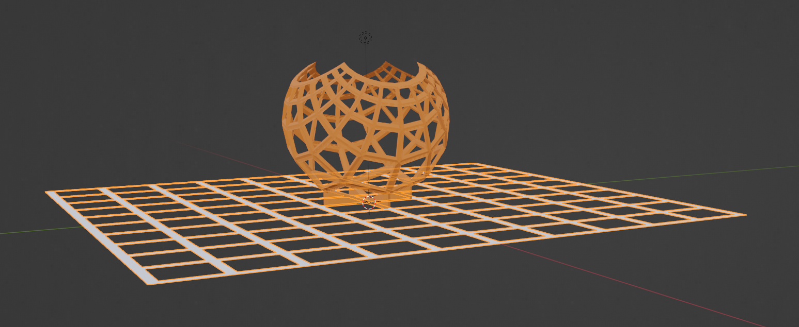

# Blender_Playground
A place to store my blender scripts

**GT_straighten_1_1.py** - An addon for blender that will straighten lines. Select a series of lines in the viewport, run script. New line positions will form a straight line from point to point. 

**GT_curve_1_1.py** - An addon for blender that will curve multiple lines selected. 

**projection.py** - A script that will project all the vertices from a flat plane through a sphere. This can be used to demonstrate stereographic projection. Basic usage: in object mode, select a flat plane. Set variables in script such that every vertex in the selected object would intersect a sphere of X diameter from X center when projected toward the vector point light. If this occurs for every vertex, another object will be made. If not, there will be an error, as I haven't implemented any error handling for cases where there are no intersections. 

